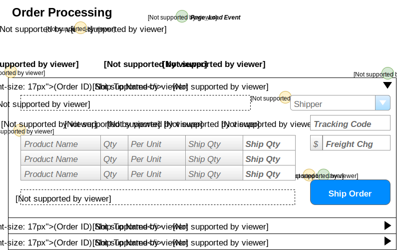

# Order Processing

> Orders are shipped directly from our suppliers to our customers. As such, suppliers log onto our system to see what orders there are for the products that they provide.

## User Interface

Suppliers will be interacting with a page that shows the following information.


The information shown here will be displayed in a **ListView**, using the *EditItemTemplate* as the part that shows the details for a given order.

## Events and Interactions


-  - **Page_Load** event
    -  - Supplier/Contact names obtained from who the logged-in user is.
    -  - Load the ListView data
        - **`List<OutstandingOrder> OrderProcessingController.LoadOrders(supplierID)`**
    -  - Load the list of shippers from BLL
        - **`List<ShipperSelection>OrderProcessingController.ListShippers()`**

## POCOs

### Commands

### Queries

```csharp
public class OrderItem
{
    public int ProductID {get;set;}
    public string ProductName {get;set;}
    public short Qty {get;set;}
    public string QtyPerUnit {get;set;}
    public short Outstanding {get;set;} // Calculated as OD.Quantity - Sum(Shipped qty)
}
```

## BLL Processing